# Name

Irfan Nadiadi

# How many points have you earned?

100/100

(Make your own calculation and replace the number 0 with the points you think you've earned.)

# How many hours have you spent on this?

fill-in-your-answer

# When did you first start working on this week's learning challenges?

Sunday Evening. Sorry, my Senior Design project has been getting the best of me.

# What is the most difficult part about this week's challenge?

fill-in-your-answer

# Show and tell (8 points)

## Link (2 points)

[Spotify's Secret Weapon](http://www.thembj.org/2014/10/spotifys-secret-weapon/)

## Discuss how you may apply the machine learning technique mentioned in this article to another interesting problem (6 points).

This article describes Spotify's acquisition of The Echo Nest, a company that specializes in music intelligence. Their software combs massive amounts of data online, nearly anything pertaining to music, and uses the data to enhance its own ability at predicting music listening behaviors. Such predictions are very valuable for users, as they're going to be more satisfied when the software continues to find music that they're grooving to. Considering how much data is available online, it is interesting to see how valuable such novel data applications can really be. The Echo Nest makes it so that users no longer have to go searching for music they feel like listening to. Rather, the software predicts for them. This begs the question, are there other ways data can be used to enhance people's lives in ways that similar to this one?

# D3 IV

## Checkpoints (3 points x 4 = 12 points)

# 1. (3 points)

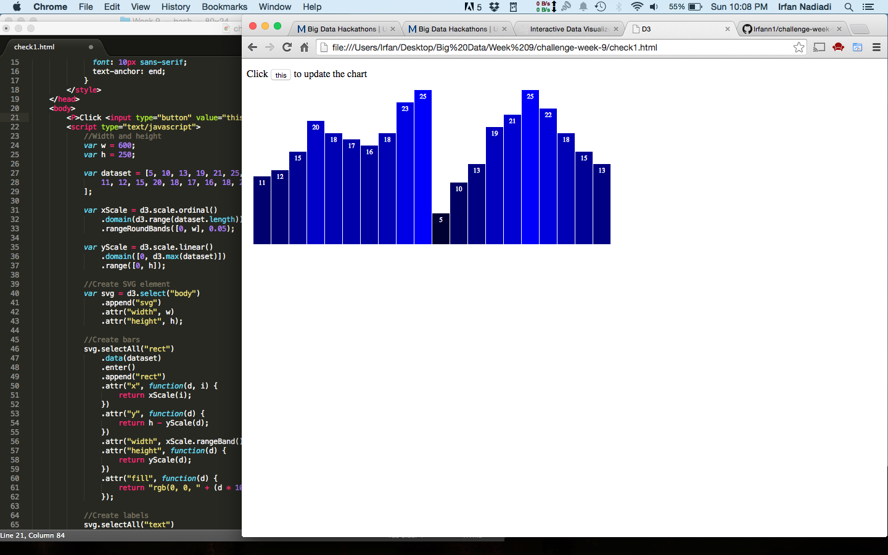

[checkpoint](check1.html)

# 2. (3 points)

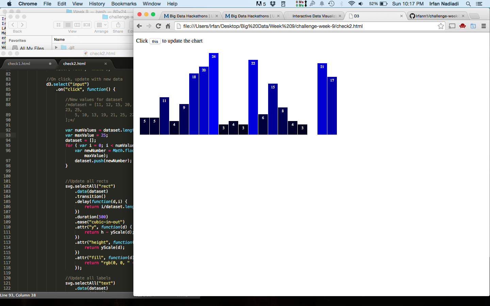

[checkpoint](check2.html)

# 3. (3 points)

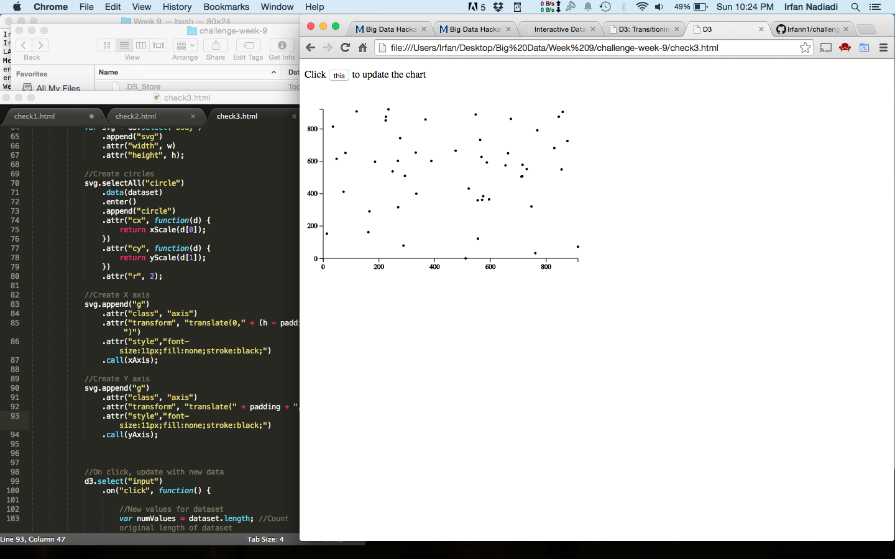

[checkpoint](check3.html)

# 4. (3 points)

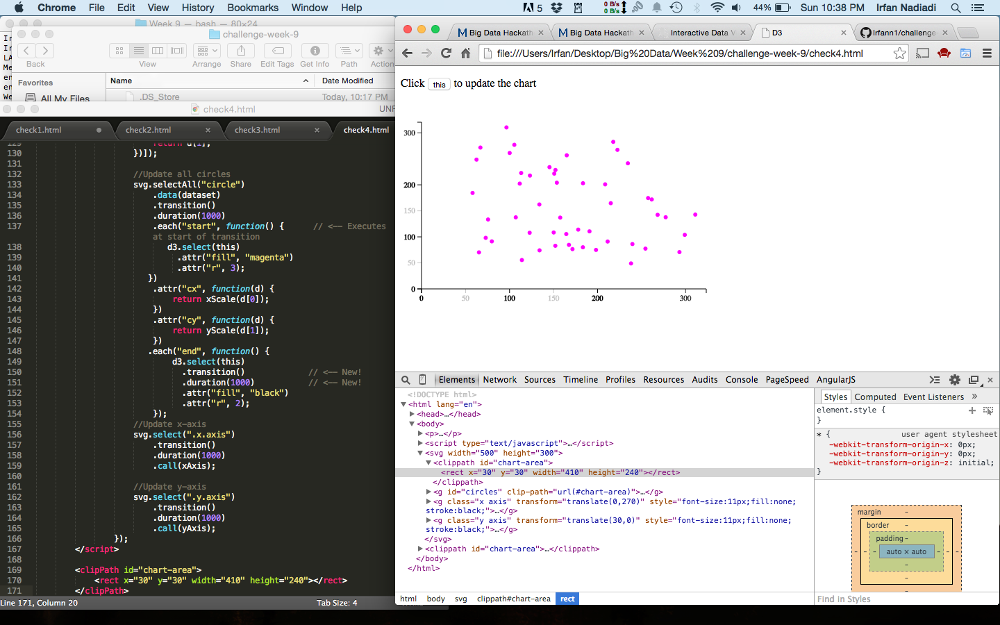

[checkpoint](check4.html)

## Challenges (4 points x 3 = 12 points)

# 1. (4 points)

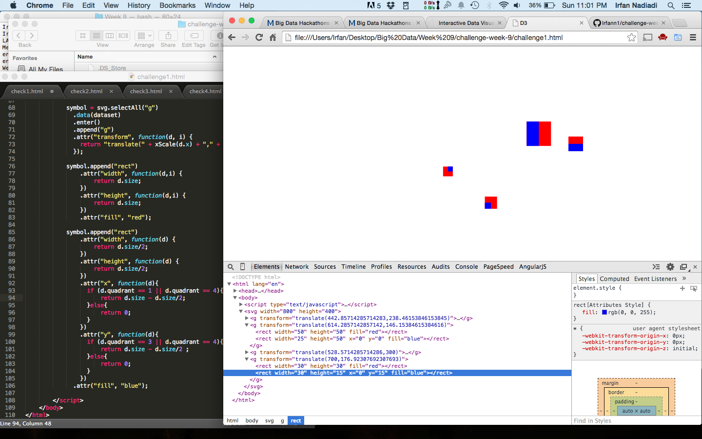

# 2. (4 points)

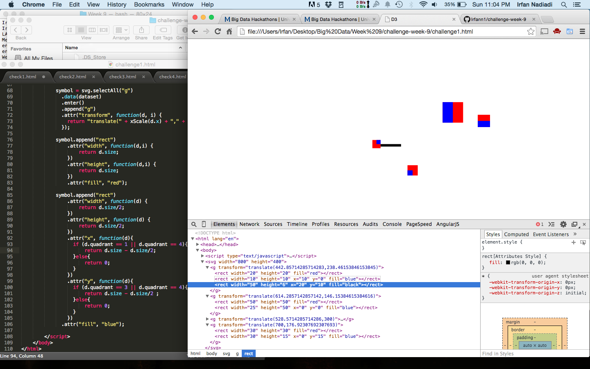

# 3. (4 points)

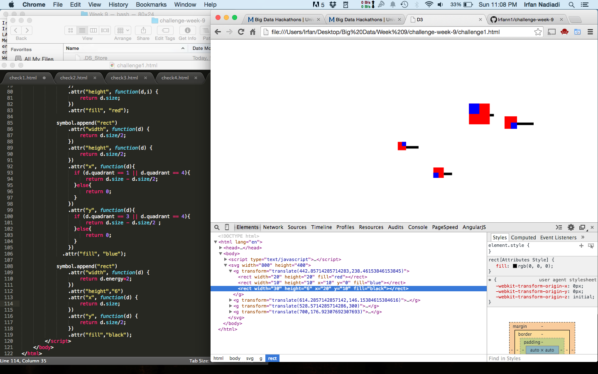

[challenge3](challenge3.html)

# MongoDB II

## Checkpoints (6 points x 2 = 12 points)

### 1 (6 points)

[mongodb js code collecting github events about our course](mongo/mongodb-github.js)

### 2 (6 points)

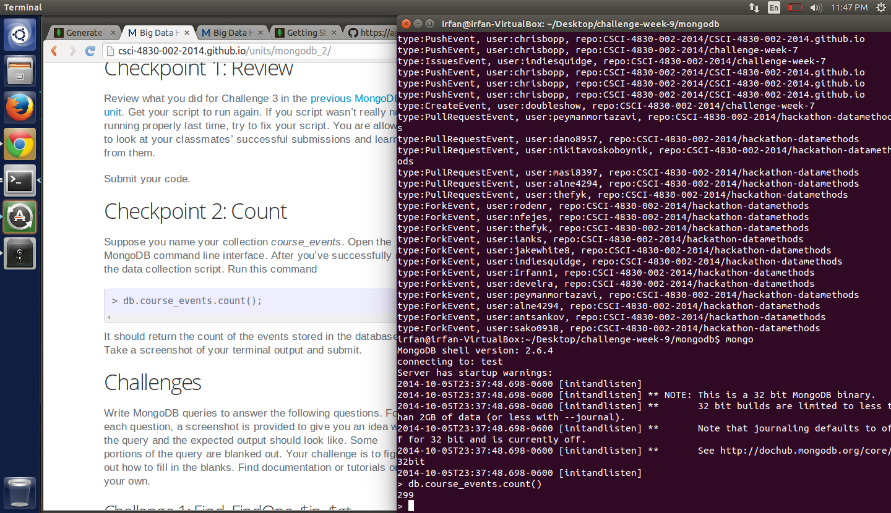

## Challenge 1 (4 points x 10 = 40 points)

### 1 (4 points)

> db.course_events.findOne({'actor.login':'Irfann1'})

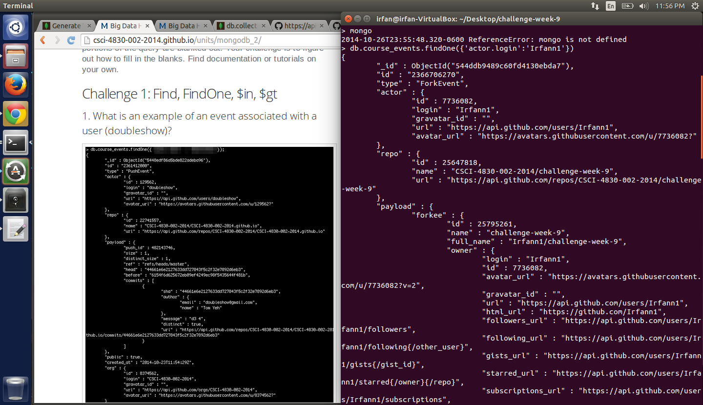

### 2 (4 points)

> db.course_events.findOne({'actor.login':'Irfann1'},{'actor':'1'})

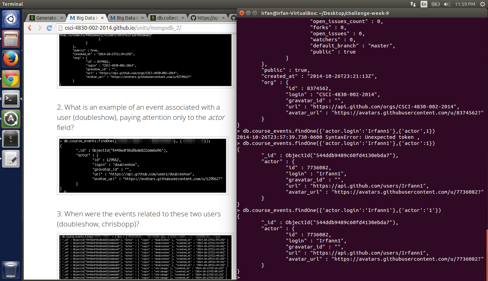

### 3 (4 points)

> db.course_events.find({'actor.login' : { $in : ['doubleshow', 'chrisbopp']}}, {'actor.login':1, created_at:1})

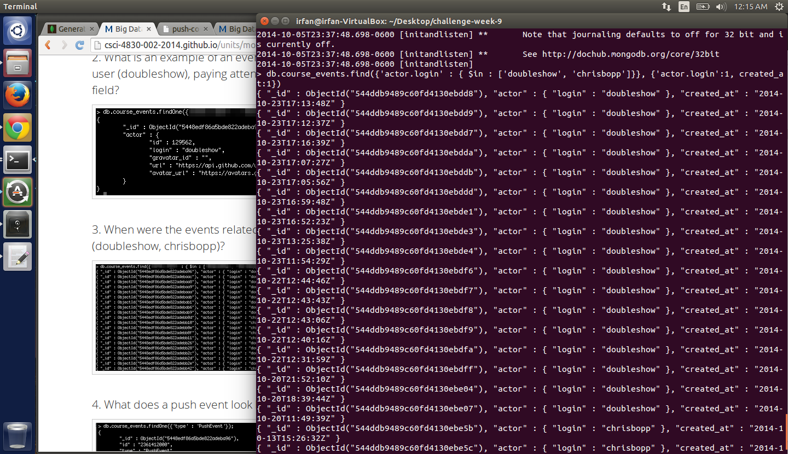

### 4 (4 points)

> db.course_events.findOne({'type' : 'PushEvent'})

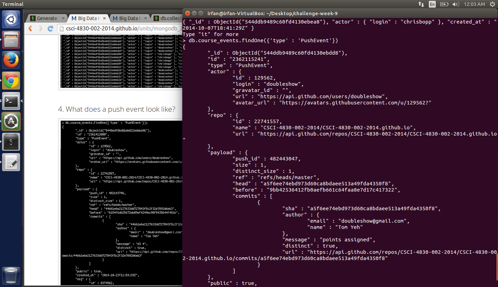

### 5 (4 points)

> db.course_events.find({'type' :'PushEvent'}, {'payload.commits.author.name':1})

### 6 (4 points)

> db.course_events.findOne({'type' :'IssuesEvent'}, {'payload':1})

### 7 (4 points)

> db.course_events.find({'type' :'IssuesEvent'}, {'payload.issue.user.login':1})

### 8 (4 points)

> db.course_events.find({'type' :'IssuesEvent', 'payload.issue.state': 'closed'}, {'payload.issue.id':1, 'payload.issue.state':1})

### 9 (4 points)

> db.course_events.find({'type' :'IssuesEvent', 'payload.issue.state': 'open'}, {'payload.issue.user.login':1, 'payload.issue.state':1})

### 10 (4 points)

> db.course_events.find({'type' :'IssuesEvent', 'payload.issue.comments' : {$gt : 0}}, {'payload.issue.user.login':1, 'payload.issue.comments':1})

## Challenge 2 (8 points x 2 = 16 points) 

### 1 (8 points)

What does a pull request look like?

> db.course_events.fineOne({'type':'PullRequestEvent' });

### 2 (8 points)

Who was the most recent person to create a pull request?

> db.course_events.find({'type':'PullRequestEvent','payload.action':'opened'},{'actor.login':1,'payload.pull_request.created_at':1}).sort({'payload.pull_request.created_at':-1})

